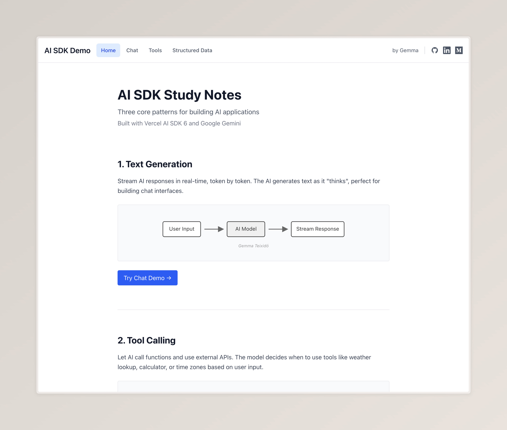
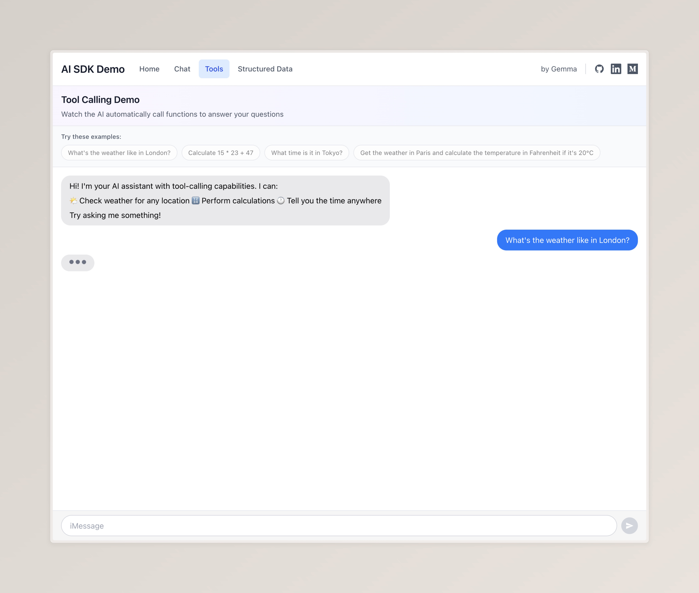

# AI SDK Demo

> Next.js app showcasing **Vercel AI SDK 6** with **Google Gemini**


### AI SDK
- [AI SDK Docs](https://sdk.vercel.ai) - Official documentation
- [Streaming](https://sdk.vercel.ai/docs/foundations/streaming) - Real-time responses
- [Tool Calling](https://sdk.vercel.ai/docs/foundations/tools-and-tool-calling) - Function execution
- [Structured Data](https://sdk.vercel.ai/docs/ai-sdk-core/generating-structured-data) - Typed JSON

### Google Gemini
- [Get API Key](https://aistudio.google.com/app/apikey) - FREE, no credit card
- [Gemini Docs](https://ai.google.dev/gemini-api/docs) - Official documentation


## Core Features

### 🏠 **Home**


---

### 💬 **Streaming Chat**
Real-time AI conversations with markdown formatting

- Smooth streaming responses
- iMessage-style interface
- Concise, well-formatted answers
- Built with `streamText()` and `useChat`

<!-- Screenshot: Streaming Chat -->


---

### 🛠️ **Tool Calling**
AI agents that use external APIs and functions

**Three built-in tools:**
- **Weather** - Live weather data from wttr.in
- **Calculator** - Safe math expression evaluation
- **Time** - Timezone-aware time lookups

<!-- Screenshot: Tool Calling -->


---

### 📊 **Structured Data**
Extract typed JSON from natural language

**Three schema types:**
- **Recipes** - Ingredients, instructions, nutrition
- **Music Albums** - Tracks, artists, awards
- **Road Bikes** - Specs, Tour de France history

Side-by-side JSON and rendered views with automatic images!

<!-- Screenshot: Structured Data -->


## Run


```bash
pnpm install
```
```bash
pnpm dev
```
```bash
pnpm test        # Run tests
pnpm test:ui     # Test UI
```

### API Keys
https://aistudio.google.com/app/apikey

https://www.pexels.com/api/


## 🛠️ Tech Stack

- **Next.js 15** - React framework with App Router
- **TypeScript** - Type safety throughout
- **Vercel AI SDK 6** - AI integration (`streamText`, `streamObject`, `tool`)
- **Google Gemini 2.5 Flash** - FREE LLM provider
- **Zod** - Schema validation
- **Tailwind CSS** - Styling
- **React Markdown** - Markdown rendering in chat
- **Vitest + React Testing Library** - Comprehensive testing (107 tests)